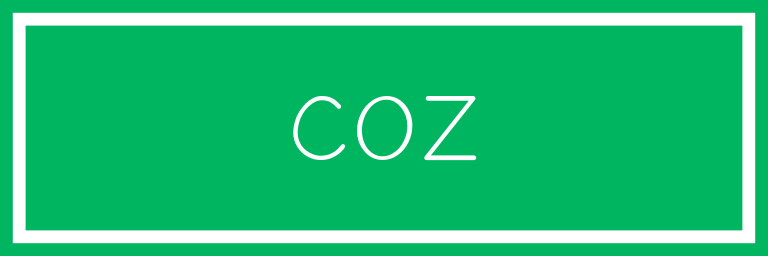
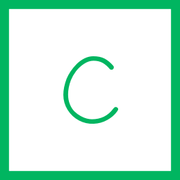

fur-examples
============

Examples for fur

[![Build Status][my_travis_badge_url]][my_travis_url]
[![npm version][my_npm_budge_url]][my_npm_url]

+ [Banner Examples](#banner-examples)
+ [Favicon Examples](#favicon-examples)

Banner Examples
------------

| Image | Command |
| ------- | ------ |
|  | `$ fur banner "fur-banner.svg" --text="FUR" --color="#ff9100" --font="bt" --shape="a" ` |
|  | `$ fur banner "coz-banner.svg" --text="coz" --color="#00b560" --font="aa" --shape="b" ` |
|  | `$ fur banner "apeman-banner.svg" --text="apeman" --color="n" --font="p" --shape="a" ` |
|  | `$ fur banner "pudding-banner.svg" --text="PUDDING" --color="bi" --font="cn" --shape="e" ` |
|  | `$ fur banner "pon-banner.svg" --text="pon" --color="ah" --font="ar" --shape="f" ` |
|  | `$ fur banner "the-banner.svg" --text="the" --color="ac" --font="e" --shape="f" ` |

Favicon Examples
------------

| Image | Command |
| ------- | ------ |
|  | `$ fur favicon "f-favicon.svg" --text="F" --color="#ff9100" --font="bt" --shape="a" ` |
|  | `$ fur favicon "c-favicon.svg" --text="c" --color="#00b560" --font="aa" --shape="c" ` |
|  | `$ fur favicon "ap-favicon.svg" --text="ap" --color="n" --font="p" --shape="g" ` |
|  | `$ fur favicon "p-favicon.svg" --text="P" --color="bi" --font="cn" --shape="a" ` |
|  | `$ fur favicon "pon-favicon.svg" --text="pon" --color="ah" --font="ar" --shape="g" ` |
|  | `$ fur favicon "the-favicon.svg" --text="the" --color="ac" --font="e" --shape="c" --font-size="124" ` |

Links
--------

+ [fur](https://github.com/fur-repo/fur)

[my_travis_url]: http://travis-ci.org/fur-repo/fur-examples
[my_travis_badge_url]: http://img.shields.io/travis/fur-repo/fur-examples.svg?style=flat
[my_npm_url]: http://www.npmjs.org/package/fur-examples
[my_npm_budge_url]: http://img.shields.io/npm/v/fur-examples.svg?style=flat
